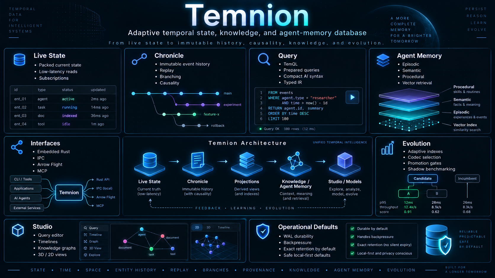

# Temnion

**A standalone, Rust-first exact-state and history engine, built in explicit
milestones.**

> [!CAUTION]
> **Temnion is publicly available experimental software. Use it at your own
> risk.** It may lose, corrupt, or render data inaccurate; do not use it as the
> only copy of important data. To the extent permitted by applicable law and
> unless otherwise agreed in writing, you assume this risk: the software comes
> without warranty, and its copyright holders and other parties who modify or
> distribute it are not liable for resulting data loss, data corruption, or
> related damages. Read the [full experimental software disclaimer](DISCLAIMER.md)
> and the controlling terms in [`LICENSE`](LICENSE).



Temnion separates live state from append-only evidence. Its long-term architecture
adds durable history, deterministic reconstruction, derived knowledge (EKS),
versioned transformations, carefully gated evolution, and decoupled consumer integration.
Tzeentch is an integrated first consumer, fully decoupled from the deterministic database core.

> **Current status: packed state, typed scalar schemas, durable logs, deterministic replay, lossless codecs, branching timelines, causal DAG tracing, hierarchical summaries, Morton N-D layouts, alternate projections, virtual shards, background task DAG, storage hierarchy, typed query IR, TemQL, compact Tem, SQL, TNP wire protocol, local IPC, Arrow columnar layout, C ABI, Arrow Flight, Model Context Protocol (MCP), Epistemic Knowledge Store (EKS), deterministic transformations, canonical IR e-graphs, isolated measured evolution, model-agnostic Tzeentch consumer adapter, multi-cadence timing, desktop Temnion Studio with Tzeentch Explorer, scale/lifecycle release qualification (R1–R6, M01–M44 complete), and standalone background daemon (`temniond`) with systemd and Windows Service integrations.**
> `EventLog<T>` remains volatile. `temnion-storage::Store` persists checked WAL
> batches and acknowledges only after OS synchronization, with explicit recovery,
> immutable TSF exports, retention policies with causal reference holds, and CRC32 point-in-time backup/restore. `temnion-replay` provides checksummed checkpoints and
> deterministic reconstruction with bit-for-bit replay equivalence. `temnion-codec`
> provides dynamically scored lossless compression primitives. `temnion-branch`
> provides structurally shared branching timelines and persistent DAG manifests.
> `temnion-causal` provides CSR-packed causal graphs and bidirectional DAG tracing.
> `temnion-index` provides hierarchical summaries, clock-scoped zone maps, entity
> Bloom filters, Morton 2D/3D space-filling curves, and zero-payload-duplication
> alternate projections. `temnion-runtime` provides single-writer virtual-shard
> partitioning, priority background task DAG scheduling, and tiered storage management.
> `temnion-query` provides canonical typed query IR, physical planning, EXPLAIN,
> and equivalent human TemQL and AI-compact `tn:` parsers. `temnion-protocol`
> provides framed binary wire protocol (TNP), capability negotiation, local duplex IPC,
> Arrow columnar batch layout, and safe handle-based C ABI. `temnion-flight`
> provides remote authenticated Arrow Flight bulk analytical streaming. `temnion-mcp`
> provides the control-plane Model Context Protocol (MCP) JSON-RPC 2.0 server.
> `temnion-eks` provides the Epistemic Knowledge Store with truth maintenance,
> cascading retraction, `WHY` provenance traversal, predictive calibration, and tiered consolidation.
> `temnion-transform` provides deterministic transformations, CPU/memory resource metering,
> and canonical query IR e-graph optimization with equality saturation and cycle-safe extraction.
> `temnion-evolution` provides isolated measured evolution, adaptive physical memory,
> adaptive lifecycle evaluators, and immutable Constitution hardening.
> `temnion-adapter` provides the decoupled consumer adapter, content-addressed media references (`MediaRef`),
> bounded mirror writes with zero silent drops, multi-timescale cadence scheduling, and causal action trace introspection.
> `temniond` provides the standalone background service daemon hosting TNP, Flight, and MCP endpoints, accompanied by Linux `systemd` and Windows Service integrations and release packaging automation.

## What works now

| Package | Implemented foundation |
| --- | --- |
| `temnion-core` | Shard/entity identities, independent source/epoch/sequence event IDs, clock-domain timestamps, valid/observed/known time and clock-scoped ranges |
| `temnion-state` | Generic dense `StateSlab<T>`, generation-safe slot reuse, bounded capacity, checked access and removal |
| `temnion-events` | Per-source bounded `EventLog<T>`, typed payloads, atomic batch admission, entity/time/known-as-of filters and bounded snapshot pagination |
| `temnion-schema` | Validated scalar schemas, exact typed values, sparse mutations, atomic in-memory apply and bounded canonical binary encoding |
| `temnion-format` | Versioned, bounded, checksummed WAL headers/batches and independently readable raw TSF v1 segments |
| `temnion-storage` | OS writer locks, synchronized batches, restart-stable identity/sequence, explicit tail recovery, predicate pushdown block skipping, companion TSM export, retention policies, causal reference holds, CRC32 point-in-time backup/restore, and manifest-based WAL retirement |
| `temnion-codec` | Strictly lossless codecs (Raw, RLE, BitPack, Delta-FOR, XOR) with CRC32C framing, dynamic scoring and raw fallback |
| `temnion-index` | Hierarchical summaries (TNSM), zone maps, Bloom filters, Morton 2D/3D SFC layouts, and zero-duplication alternate projections (TNPR) |
| `temnion-replay` | Deterministic reconstruction, periodic atomic checkpoints (TNCP), SplitMix64 step-counted PRNG tracking and bit-for-bit replay equivalence |
| `temnion-branch` | Structurally shared timeline branching, zero-payload-duplication forks, atomic manifest updates (TNBM), lifecycle states, and interval timeline resolution |
| `temnion-causal` | First-class causal graph (TNCG), CSR-packed flat indexing, bidirectional immediate queries, transitive causal/effect cone tracing, topological sort, and cycle detection |
| `temnion-runtime` | Single-writer virtual shards, routing policies, deterministic total-order merge, priority-weighted background task DAG with Kahn cycle prevention and pressure throttling, and three-tier storage hierarchy with LRU eviction and auto-promotion |
| `temnion-query` | Canonical typed query IR (LogicalPlan, Expr), physical planning with predicate pushdown (PhysicalPlan), EXPLAIN formatting, reference executor with resource budgets, and equivalent human TemQL and AI-compact tn: shorthand parsers |
| `temnion-protocol` | Framed binary protocol (TNP), handshake negotiation, streaming query results, duplex pipe/socket IPC (TnpChannel, TnpServer), Arrow columnar layout (ColumnarBatch), and panic-safe C ABI (temnion_c_*) |
| `temnion-flight` | Authenticated Arrow Flight remote analytical transport (`FlightDescriptor`, `Ticket`, `FlightInfo`, `FlightData` streaming columnar batches, `FlightService`) |
| `temnion-mcp` | Model Context Protocol (MCP) JSON-RPC 2.0 control-plane server exposing query, explain, inspect, branch, causal, why_trace, and rewrite_expr tools, resources, and prompt templates |
| `temnion-eks` | Epistemic Knowledge Store (EKS) with versioned primitives (`Observation`, `Claim`, `Belief`, `Concept`, `Rule`, `ModelManifest`, `Skill`), truth maintenance with non-destructive cascading retraction, `WHY` provenance traversal, predictive ledger with Brier score calibration, and tiered consolidation (`Active`, `Reference`, `Archive`) |
| `temnion-transform` | Deterministic transformation engine with versioned manifests, typed signatures, CPU/memory resource metering, immutable lineage logs, and canonical query IR e-graph optimizer with equality saturation, constant folding, and cycle-safe plan extraction |
| `temnion-evolution` | Isolated measured evolution engine (`EvolutionEngine`, `ChampionChallengerRegistry`), adaptive physical memory and lifecycle evaluators, semantic/vector projection index (`SemanticProjectionIndex`), gated meta-evolution (`MutationPolicy`), and runtime immutable Constitution hardening (`Constitution`, 8 axioms, `ConstitutionAudit`) |
| `temnion-adapter` | Model-agnostic consumer adapter, NIST FIPS 180-4 SHA-256 media references (`MediaRef`), action/intention separation, bounded dual-write mirror queue (`MirrorWriter`), multi-timescale scheduler (Fast 120Hz, Medium 20Hz, Slow 1Hz, Background 0.1Hz), causal action tracer (`TzeentchActionTracer`), standardized database network connector (`ConnectionConfig`, `ActiveConnection`), and standalone `tzeentch` client binary |
| `temniond` | Standalone background service daemon hosting TNP (`:9180`), Arrow Flight (`:9181`), and MCP endpoints with TOML configuration (`DaemonConfig`), database superuser credentials, periodic maintenance thread, Linux systemd unit, and Windows Service automation scripts |
| `temnion-cli` | Volatile demo plus durable `init`, `append`, `history`, `inspect`, `recover`, `seal`, `verify-segment`, `inspect-summary`, `checkpoint`, `reconstruct`, `evaluate-codecs`, `branch-create`, `branch-list`, `causal-trace`, `query`, `explain`, `mcp`, `why-demo`, `rewrite-demo`, `evolve`, `tzeentch`, and `benchmark scale` commands |
| `temnion-studio` | Tauri 2 + React/TypeScript desktop client and interactive Web Workbench (MySQL Workbench / pgAdmin style) featuring Query Studio, Temporal Plane, Branches & Causality, Ingestion Console, Schema & Entity Catalog, Connections Manager, and Storage & Capabilities |
| `temnion-bench` | In-memory baselines, durable on-disk batch workloads, multi-cadence scale harness (4K, 64K, 1M+ active records), and retention lifecycle stress harness |

Disk history uses a source-local WAL batch-offset index, hierarchical block summaries
with zone maps and Bloom filters, zero-duplication alternate projections, and bounded frame decoding.
Startup scans the authoritative WAL.
Exports retain or retire that WAL into sealed immutable segments with manifest verification. Typed schemas are library APIs; the low-level
CLI records a schema ID with opaque bytes, without a persistent schema registry.

**All core roadmap milestones completed:** core engine, storage tiers, EKS, transformations, evolution, decoupled Tzeentch integration & connector, standalone daemon (`temniond`), manifest-based WAL retirement, Studio Workbench IDE, and PostgreSQL-style component installer.

## Quick start

Install [Rust through rustup](https://rustup.rs/) and the platform's native linker.
Windows MSVC builds need Visual Studio C++ Build Tools; Linux builds need the
usual C compiler/linker development packages. No Node, npm, GUI, model runtime,
CUDA, or service is needed for the headless engine and CLI. Studio has separate
[desktop prerequisites and run instructions](docs/STUDIO.md).

From the repository root:

```text
cargo run -p temnion-cli -- version
cargo run -p temnion-cli -- describe
cargo run -p temnion-cli -- demo
```

The scripted demo writes no files. It illustrates typed events, late evidence
excluded by a known-time cutoff, bounded history pages, and stale-handle
rejection. Its current state follows **arrival order**; this is not a durable
replay demonstration or a general temporal materialization policy.

For a persistent source log:

```text
cargo run -p temnion-cli -- init local-databases\example
cargo run -p temnion-cli -- append local-databases\example 0:1:0 1 1:5 2:10 2a00
cargo run -p temnion-cli -- history local-databases\example
cargo run -p temnion-cli -- inspect local-databases\example
cargo run -p temnion-cli -- seal local-databases\example
```

Use your platform's path separators. The append arguments are entity identity,
schema ID, valid clock/tick, known clock/tick, and hexadecimal payload.
See [durable storage](docs/STORAGE.md) before using recovery or interpreting
durability, query budgets and segment lifecycle.

Runnable embedded examples:

```text
cargo run -p temnion-state --example packed_state
cargo run -p temnion-events --example history
cargo run -p temnion-schema --example typed_mutation
cargo run -p temnion-format --example binary_roundtrip
cargo doc --workspace --no-deps
```

## Toolchain and platforms

The workspace uses Rust edition 2024, resolver 3, and MSRV **1.85**.
`rust-toolchain.toml` pins **1.85.0** with rustfmt and Clippy. Project source
forbids unsafe code. The core/state/events/schema libraries remain std-only;
the storage/format layers use explicit checksum, OS-locking and entropy
dependencies listed in the [inventory](docs/DEPENDENCIES.md).

| Target goal | Foundation validation policy |
| --- | --- |
| Windows x64, MSVC | CI configured for native formatting, Clippy and tests on `windows-2022` |
| Linux x64, GNU | CI configured for native formatting, Clippy and tests on `ubuntu-22.04` |
| Linux ARM64, GNU | CI cross-**checks** Rust code only; no ARM64 linking or execution in that job |
| NVIDIA AGX Orin Developer Kit | JetPack 6.2.2 / L4T 36.5 / Ubuntu 22.04 is the native qualification goal, not a verified result |

CI checks both pinned 1.85.0 and latest stable on x64. Native ARM64 tests,
performance, userspace compatibility, and eventual native ARM64 Studio remain
required future qualification; a cross-check is not a substitute.

## Development and measurement

```text
cargo fmt --all -- --check
cargo clippy --workspace --all-targets -- -D warnings
cargo test --workspace
cargo run --release -p temnion-bench -- --entities 4096 --events 100000 --iterations 100000
```

The default benchmark is volatile. Its separate `--bin durable` workload measures
OS-synchronized batches and reopen recovery against a framed-file lower bound.
Neither establishes Gate A. See [BENCHMARKING](docs/BENCHMARKING.md) for commands,
acknowledgment boundaries, comparisons, and the remaining A–L program.

## Documentation

- [Architecture](docs/ARCHITECTURE.md): current boundaries and the complete design.
- [Roadmap](docs/ROADMAP.md): R0–R6, T00–T21, all source M0–M44, and Gates A/B/C.
- [Core contract ADR](docs/adr/0001-foundation-contracts.md): identities, clocks,
  state, volatile append/query semantics, and requirements before persistence.
- [Compatibility](docs/COMPATIBILITY.md): Rust API, toolchains, future formats,
  protocols, upgrades, and release evidence.
- [Durable storage](docs/STORAGE.md), [binary formats](docs/BINARY_FORMAT.md),
  and [typed schemas](docs/SCHEMA.md).
- [Temnion Studio](docs/STUDIO.md): desktop prerequisites, real local flows,
  enforced view limits, validation commands and remaining M23 gaps.
- [Dependency and license inventory](docs/DEPENDENCIES.md).
- [Experimental software disclaimer](DISCLAIMER.md): data-loss risk, warranty,
  liability, and applicable-law limits.
- [Original architecture artifacts](docs/architecture/source/README.md):
  unchanged historical sources, not documentation of shipped interfaces.
- [Security](SECURITY.md) and [contributing](CONTRIBUTING.md).

Outside code contributions are **not being accepted** until the owner approves
CLA/relicensing terms. Bug reports and design feedback are welcome; a DCO alone
does not establish commercial relicensing rights.

## License

This project is dual-licensed:

- **AGPL-3.0** for open-source use under the terms in [`LICENSE`](./LICENSE).
- **Commercial license** for proprietary, closed-source, OEM, SaaS, or other
  uses requiring separately negotiated rights. See
  [`COMMERCIAL_LICENSE.md`](./COMMERCIAL_LICENSE.md).

Commercial licensing: **willaveryvy@gmail.com**

The public source licensing path is **AGPL-3.0-only**. The commercial notice is
not itself a license grant; separate written terms are required. AGPL licensing
does not prohibit commercial activity. Third-party licenses and notices remain
applicable. See [LICENSING](LICENSING.md) for details.

Copyright © 2026 William Lawrence Avery.
